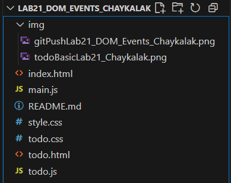

# Лабораторная работа №21: Создание приложения TODO

## Основная информация

**ФИО:** Чайкалак Данара Рустамовна

**Группа:** ИСП-231

**Дата:** 05.06.2026

## Описание

В ходе выполнения лабораторной работы были изучены следующие темы:

1. **Создание TODO-листа** – классическое приложение для демонстрации работы с DOM
2. **Поиск и создание элементов** – `getElementById()`, `createElement()`, `appendChild()`
3. **Обработка событий** – `addEventListener()`, клики, нажатие Enter
4. **Работа с формами** – получение значений (`value`), валидация, очистка полей
5. **Динамическое обновление интерфейса** – добавление/удаление задач, обновление счётчика
6. **CSS-стилизация** – оформление приложения, адаптивный дизайн, состояния кнопок

## Структура проекта
